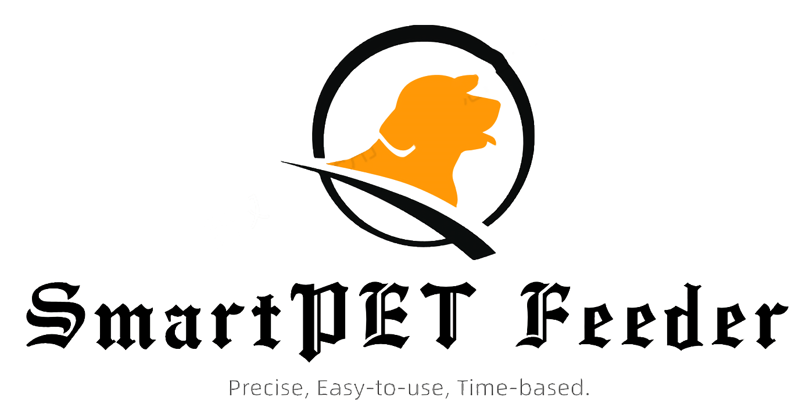

# SmartPET Feeder
  
The open-source, easy-to-use feeder

## Installation:

### Requirements:
#### For Raspberry Pi:
+ A Raspberry Pi with Raspberry Pi OS (of course).
+ A touchscreen
+ A outer shell (recommanded because the pet may break the machine.)
#### For Espressif ESP32:
+ A Expressif ESP32 module (of course).
#### For Other Hardware:
+ A stepper motor that is fit the size of moter in 3D model and a A4988 stepper motor driver.
+ You need 3D-print or some way to make the feeder hardware (the .obj 3D file is in `hardware` directory).
+ Some wires and power supply.
### Install:
#### For Raspberry Pi:
+ Just use `bash raspberry_pi/install.sh`, and it will automatic install.
#### For Espressif ESP32:
+ Please use PlatformIO to open the project and just upload it.

### Usage
#### Quick Start
+ To use, run the start.sh file in the desktop and it will automatic run. 

#### Model Training
+ You may train your own model because the motor was diffrenet. Before training, please look at the comments in `other/train.py` and follow the instruction of the comment. And you need to run `python other/train.py`.
+ You must convert .h5 hdf5 format to the .tflite tensorflow lite format and replace `raspberry_pi/src/model.tflite` to your model.

#### ESP32 Use
+ You can use it by write s{your rounds}; to the serial.

#### Web API Use
+ Feed: POST /api/food JSON input: {"weight": $your feeding weight}
+ Add plan: POST /api/plan JSON input: {
                                       "time_h": $hour,
                                       "time_m": $minutes,
                                       "weight": $weight
                                       }
+ Delete plan: DELETE /api/plan JSON input:{
                                           "time_h": $hour,
                                           "time_m": $minutes,
                                           }

#### Mobile APP Use
+ I developed a mobile app (Now just in Android bring it in iOS later). It was simple and crude for now. If you can contribute, 
please contribute to it. Project Address: https://github.com/smart2pet/SmartPETFeederMobile.git. 
## Contributing:
+ We accept and welcome contributes. You can create an issue for reporting bugs. But it's better to solve them by yourself. You just need to 
create an issue for some bugs that you can't resolve or you want to make some new functions. 
+ For more details, please look at CONTRIBUTING.md.

## License

This project was licensed under GPL v3.0 license. For more detail, please look at the LICENSE file.